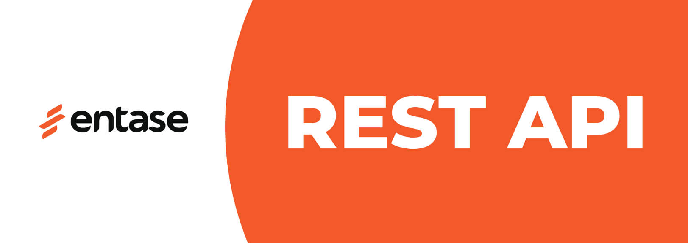

# Entase API

Make custom integrations with Entase via the REST API.

## [Documentation](https://github.com/entaseteam/api.docs/wiki)
## [PHP SDK](https://github.com/entaseteam/sdk.php)
## [Wordpress Plugin](https://github.com/entaseteam/plugin.wp)

